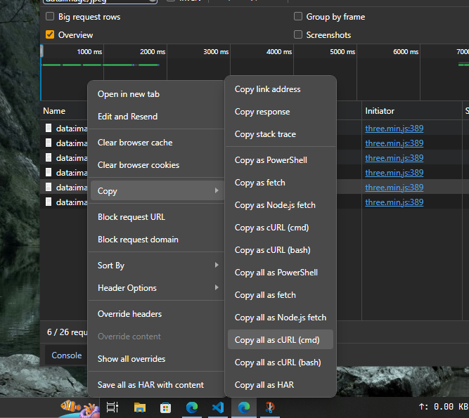
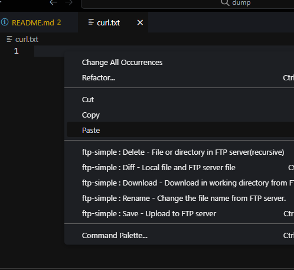

# Extract and Encode Base64 Curl to Image from Devtool's Network

this script is not based from my knowledge, but 100% from Bard Google. Thank You Bard🥳🥳

## Instalation

clone this repository :

```bash
git clone https://github.com/rifqiabd/base64extract.git
```

## How To Use

copy your curl from download all on devtool like image below


create file curl.txt on your directory and put copied curl on it


after to extract base64 as separate file, you can use ```php dump.php``` that will put base64 file to "base" folder. And use ```php decode.php``` to convert base64 to jpeg file then you can look the result on "decode" folder.
